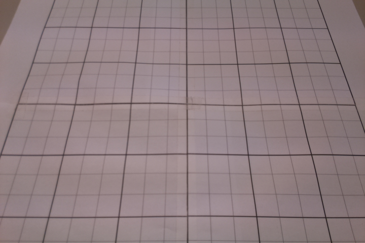

# Homographie et transformation de perspective avec OpenCV

> Ce document se réfère à ce [programme d'exemple](../../OpenCV_code/homography/homography.py).

Une [homographie](https://en.wikipedia.org/wiki/Homography) est une transformation géométrique d'un plan vers un plan qui peut se représenter par une matrice. Concrètement, le procédé consiste à faire correspondre un ensemble de points "source" d'une image avec un ensemble de points "destination" de même taille, puis de faire une interpolation pour calculer une matrice carrée de taille 3 qui décrit entièrement la transformation. On peut alors appliquer l'homographie à une image et récupérer une image déformée de sorte à ce que les points source se retrouvent aux coordonnées des points destination correspondants, et les autres points soient répartis selon la même logique.

Un cas d'utilisation courant est la correction des distortions induites par une caméra, lorsqu'on souhaite faire du repérage d'objets par caméra. En effet, l'utilisation d'une caméra induit une distortion radiale (principalement) et tangentielle (dans une moindre mesure) par rapport à la réalité.

<p align=center>
    
    <br>Distortions radiales et tangentielle
    <br><small>https://d3i71xaburhd42.cloudfront.net/f4fd9e6d321d3b1d12307a0aa48e359b604ad463/41-Figure2.3-1.png</small>
</p>

Une correction qui ferait correspondre seulement 4 couples de points, par exemple les 4 coins de l'image, ne serait donc pas suffisante.

En plus de permettre de corriger ces distortions présentes quelle que soit la caméra, cette technique permet de corriger la déformation due à l'angle que ferait le plan d'une caméra avec le plan du sol (dans le cas de repérage d'objets au sol), comme on peut typiquement être amené à construire dans un robot.

<p align=center>
    
    <br>La caméra fait un angle par rapport au sol
</p>

Ainsi, l'idée est de disposer d'une caméra qui prendra des photos déformées, puis de corriger en même temps les déformations inhérentes à la caméra et les déformations liées à l'angle que fait la caméra avec le sol. C'est ce cas d'utilisation que nous prendrons comme exemple dans la suite de ce document.

## Calcul d'une matrice de transformation avec OpenCV
Il s'agit tout d'abord de renseigner les coordonnées des points source et destination que l'on va choisir pour caractériser la transformation souhaitée. Pour cela, on peut suivre la procédure suivante:

- Mettre en place la caméra telle qu'elle sera utilisée par la suite. Une fois qu'elle est en place, ne plus la bouger car cela modifierait la transformation adéquate.
- Photographier avec cette caméra une grille parfaite (quadrillage régulier, traits perpendiculaires) assez grande pour couvrir l'ensemble du champ de vision de la caméra ou presque. L'image obtenue sert de référence pour savoir de quelle façon il faut transformer les images capturées par la caméra en général.

<p align=center>
    
    <br>Photographie d'un grille parfaite
</p>

- Relever les coordonnées en pixels d'un ensemble de points stratégiques dont on connaît la position souhaitée après transformation. La photo suivante indique dans quel repère ces coordonnées doivent être relevées. On peut s'aider de Paint pour effectuer ce relevé.

<p align=center>
    
    <br>Relevé des coordonnées des points source avec Paint
</p>

```Python
pts_src = np.array([
    [103, 17], [191, 15], [279, 15], [368, 16], [457, 15], [545, 16], [633, 16],  # line 1
    [80, 75], [177, 77], [273, 78], [369, 79], [464, 79], [560, 77], [655, 78],  # line 2
    [56, 150], [160, 147], [265, 148], [369, 152], [472, 152], [577, 151], [681, 151],  # line 3
    [35, 205], [149, 207], [259, 204], [369, 205], [478, 208], [591, 207], [701, 207],  # line 4
    [13, 271], [134, 271], [253, 271], [370, 269], [486, 270], [606, 271], [685, 271],  # line 5
    [17, 385], [106, 385], [239, 384], [370, 382], [500, 383], [632, 385],  # line 6
])
```

- Calculer les coordonnées des points destination, i.e. les nouvelles coordonnées souhaitées pour chaque point source. Pour ce faire, profiter de la structure de grille et faire en sorte de répartir équitablement les points source sur toute la largeur et la longueur de l'image. Cette étape consiste ainsi à choisir le champ de vision souhaité pour la caméra.

```Python
width, height = 720, 480

pts_dst = np.array([
    [width*0/6, height*0/13], [width*1/6, height*0/13], [width*2/6, height*0/13], [width*3/6, height*0/13], [width*4/6, height*0/13], [width*5/6, height*0/13], [width*6/6, height*0/13],  # line 1
    [width*0/6, height*3/13], [width*1/6, height*3/13], [width*2/6, height*3/13], [width*3/6, height*3/13], [width*4/6, height*3/13], [width*5/6, height*3/13], [width*6/6, height*3/13],  # line 2
    [width*0/6, height*6/13], [width*1/6, height*6/13], [width*2/6, height*6/13], [width*3/6, height*6/13], [width*4/6, height*6/13], [width*5/6, height*6/13], [width*6/6, height*6/13],  # line 3
    [width*0/6, height*8/13], [width*1/6, height*8/13], [width*2/6, height*8/13], [width*3/6, height*8/13], [width*4/6, height*8/13], [width*5/6, height*8/13], [width*6/6, height*8/13],  # line 4
    [width*0/6, height*10/13], [width*1/6, height*10/13], [width*2/6, height*10/13], [width*3/6, height*10/13], [width*4/6, height*10/13], [width*5/6, height*10/13], [width*17/18, height*10/13],  # line 5
    [width*1/18, height*13/13], [width*1/6, height*13/13], [width*2/6, height*13/13], [width*3/6, height*13/13], [width*4/6, height*13/13], [width*5/6, height*13/13],  # line 6
])
```

Enfin, on peut calculer la matrice d'homographie équivalant à cette correspondance d'ensembles de points, grâce à la fonction d'OpenCV [findHomography](https://docs.opencv.org/2.4/modules/calib3d/doc/camera_calibration_and_3d_reconstruction.html#findhomography). Il en résulte une matrice qui caractérise cette transformation:

```Python
[[ 1.37769025e+00  4.79014105e-01 -1.48424612e+02]
 [-5.30295334e-03  1.97319863e+00 -2.89386302e+01]
 [-9.11042928e-06  1.34740678e-03  1.00000000e+00]]
```

> Il faut fournir au moins 3 couples de points à la fonction ```findHomography```; plus on fournit de points, plus la matrice résultante sera précise.

> Il existe aussi la fonction [getPerspectiveTransform](https://docs.opencv.org/2.4/modules/imgproc/doc/geometric_transformations.html#getperspectivetransform), qui effectue un calcul similaire à celui de ```findHomography``` mais à partir de 4 couples de points seulement. De fait, ```getPerspectiveTransform``` et ```findHomography``` renvoient la même matrice dans le cas où la liste des points source est de taille 4.

## Utilisation d'une matrice de transformation avec OpenCV
La matrice de transformation est à calculer une seule fois pour une configuration de caméra donnée (modèle et position de la caméra). Ensuite et à chaque fois qu'on en a besoin, on utilise cette matrice pour effectuer des corrections sur toute une image ou sur un ensemble de points. OpenCV fournit pour cela deux fonctions:

- [warpPerspective](https://docs.opencv.org/2.4/modules/imgproc/doc/geometric_transformations.html#warpperspective) pour transformer toute une image
- [perspectiveTransform](https://docs.opencv.org/2.4/modules/core/doc/operations_on_arrays.html#perspectivetransform) pour transformer un ensemble de points

> Si on n'a pas besoin de disposer de l'image transformée en entier, privilégier la fonction 
```perspectiveTransform``` qui s'exécute en une durée bien plus courte que ```warpPerspective```.

On peut utiliser la fonction [imwrite](https://docs.opencv.org/2.4/modules/highgui/doc/reading_and_writing_images_and_video.html?highlight=imwrite#imwrite) pour enregistrer l'image transformée par ```warpPerspective```.

Voici le résultat pour notre image d'exemple:

<p align=center>
    
    <br>Grille corrigée par warpPerspective
</p>

## Conclusion sur l'intérêt de la transformation:
Après transformation, toutes les cases sont carrées et ont la même longueur de côté. En particulier, la grille est "droite": les traits sont soit parfaitement horizontaux, soit parfaitement verticaux.

On peut donc effectuer des mesures de distance et d'angle pour repérer la position d'objets placés au sol dans le champ de vision de la caméra. Pour ce faire, il faut au préalable [détecter les objets](../object_detection/object_detection.md) se trouvant dans ce champ de vision.

> Si les objets à détecter sont surélevés par rapport au sol, il peut se produire un phénomène de surestimation de la distance, car la détection d'objet se fait par la détection sur l'image de sa couleur, qui se trouve alors déportée par rapport à la position réelle de l'objet. Si la forme de ces objets est néanmoins connue, on peut faire une correction spécifique. En revanche, la mesure de l'angle devrait demeurer exacte.

<p align=center>
    
    <br>Surestimation de la distance dans le cas d'un objet surélevé
</p>

> Voir [Camera Calibration and 3D Reconstruction](https://docs.opencv.org/2.4/modules/calib3d/doc/camera_calibration_and_3d_reconstruction.html)
pour en savoir plus sur les questions de calibration et de correction de caméra.
