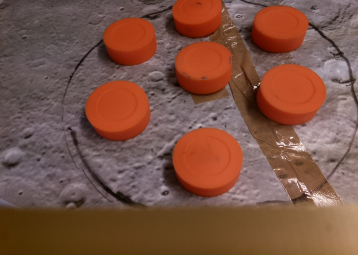
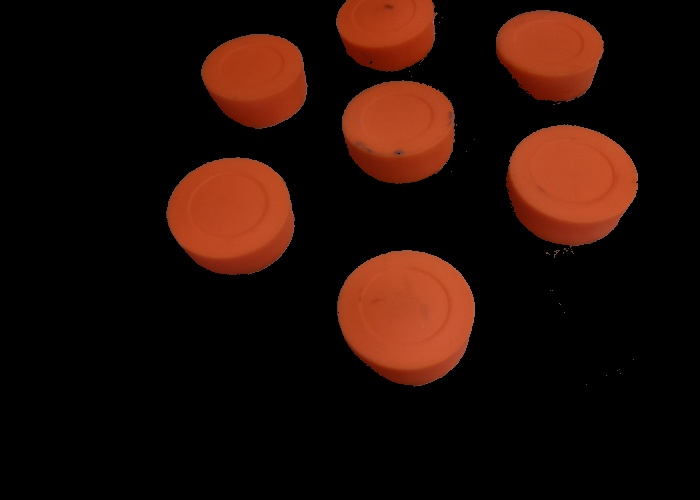
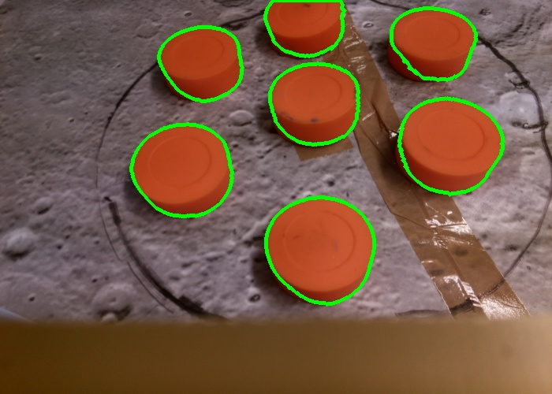
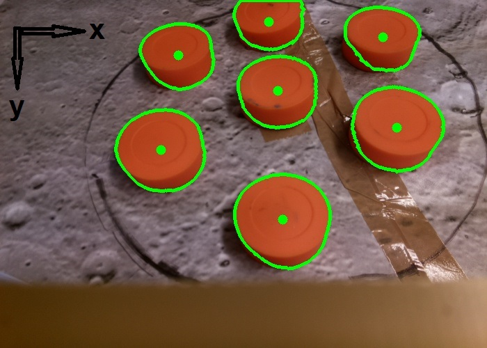
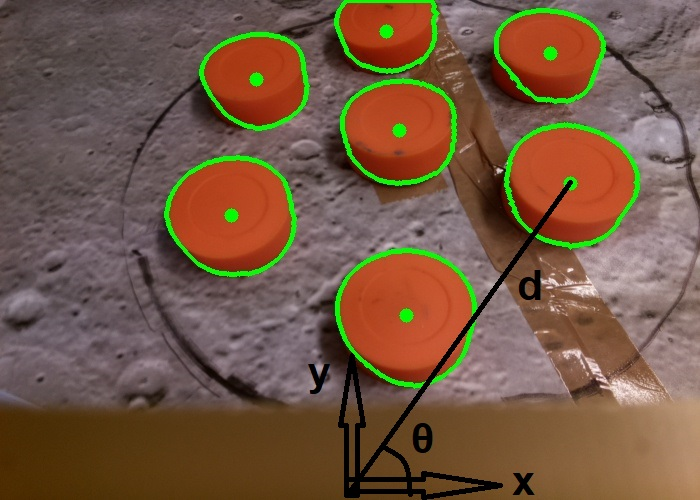

# Détection et repérage d'objets avec OpenCV

> Ce document se réfère à ce [programme d'exemple](../OpenCV_code/object_detection/object_detection.py).

L'objectif est de détecter des formes sur une image puis de les repérer dans le plan, i.e. de déterminer leurs coordonnées dans un repère choisi.

## Détection des objets
### Application d'un masque
La détection des formes se fait sur le critère de la couleur des objets cherchés. On applique un masque (un filtre) sur l'image d'origine afin de n'en récupérer que les pixels dont la valeur appartient à un intervalle donné. Pour définir cet intervalle, il faut choisir un [colorspace](https://www.learnopencv.com/color-spaces-in-opencv-cpp-python/), i.e. un système de définition des couleurs dans lequel on décide d'exprimer ses bornes.

Utiliser le color space [HSV](https://en.wikipedia.org/wiki/HSL_and_HSV) est un choix intéressant, car il permet de reconnaître aisément une coloration sous des éclairements différents, contrairement au [RGB](https://en.wikipedia.org/wiki/RGB_color_model).
Pour déterminer les valeurs des bornes de l'intervalle des couleurs acceptées, on peut alors contraindre la première composante (Hue), qui correspond à la teinte; pour les deux autres composantes (Saturation et Value), laisser la borne supérieure à la valeur maximale (255) et jouer sur les bornes inférieures pour ajuster le filtre s'avère bien fonctionner.

> La fonction OpenCV [cvtColor](https://docs.opencv.org/2.4/modules/imgproc/doc/miscellaneous_transformations.html#cvtcolor) est pratique pour convertir une valeur de couleur d'un colorspace à un autre.

Utiliser la fonction [inRange](https://docs.opencv.org/2.4/modules/core/doc/operations_on_arrays.html?highlight=inrange#inrange) pour calculer le masque sur une image en fonction de l'intervalle choisi. Le masque en lui-même est une image binaire dans laquelle les pixels valent **0** si le pixel aux mêmes coordonnées dans l'image d'origine est rejeté par le filtre, et **1** sinon.

> La fonction [bitwise_and](https://docs.opencv.org/2.4/modules/core/doc/operations_on_arrays.html#bitwise-and) permet d'afficher l'image après application du masque.

  |  
:------------------------------:|:-------------------------:
Image d'origine                 |  Image après application d'un masque

> Si un masque semble être uniquement rempli de 0 de façon inattendue, s'assurer que les bornes inférieure et supérieure de l'intervalle ne comportent pas de valeur négative. Cela est susceptible d'arriver si ces bornes sont calculées maladroitement en fonction de la valeur de la couleur cherchée.

Selon les cas, il peut être utile de lisser le masque afin d'obtenir un résultat plus proche de ce qu'on souhaite filtrer. Les fonctions [GaussianBlur](https://docs.opencv.org/2.4/modules/imgproc/doc/filtering.html?highlight=gaussianblur#gaussianblur) et [erode](https://docs.opencv.org/2.4/modules/imgproc/doc/filtering.html?highlight=erode#erode) permettent cela.

### Détection des contours
La fonction [findContours](https://docs.opencv.org/2.4/modules/imgproc/doc/structural_analysis_and_shape_descriptors.html#findcontours) permet d'obtenir une liste de contours à partir du masque, comme illutré sur l'image.

Le nombre de contours détectés par cette fonction est souvent plus grand que ce à quoi on s'attend car des contours indésirables sont présents dans la liste. On peut alors filtrer cette-dernière pour supprimer les contours accidentels ainsi que les contours dont le rayon est inférieur à un seuil choisi.

> Voir le [programme d'exemple](../OpenCV_code/object_detection/object_detection.py#L87) pour le filtrage des contours.

    
     Contours détectés après filtrage

### Calcul du centre de chaque contour
La fonction [moments](https://docs.opencv.org/2.4/modules/imgproc/doc/structural_analysis_and_shape_descriptors.html?highlight=moments#moments) permet d'obtenir aisément les coordonnées du centre d'un contour dans le repère indiqué sur l'image.

    
     Calcul du centre de chaque contour

> Voir [Find the Center of a Blob](https://www.learnopencv.com/find-center-of-blob-centroid-using-opencv-cpp-python) pour en savoir plus.

## Repérage des objets
On connaît à présent les coordonnées en pixels du centre de chaque forme cherchée dans un certain repère cartésien. On cherche à les exprimer dans un repère polaire de notre choix. Le repérage se fait donc de la façon suivante:
- on effectue un changement de repère de sorte à placer le centre du nouveau repère en bas et au centre de l'image
- on calcule la distance en centimètres et l'angle en degrés dans ce nouveau repère. Le programme a pour cela besoin du ratio permettant de convertir une distance physique en distance en pixels.

    
     Repérage des objets

> Dans le cas où l'image d'origine est une photo prise par une caméra, il est préférable de corriger la distortion automatiquement induite par la caméra, sans quoi les mesures de repérage seront sans doute erronées. On peut pour ce faire procéder au préalable à une [transformation](../homography/homography.md) sur l'image.
